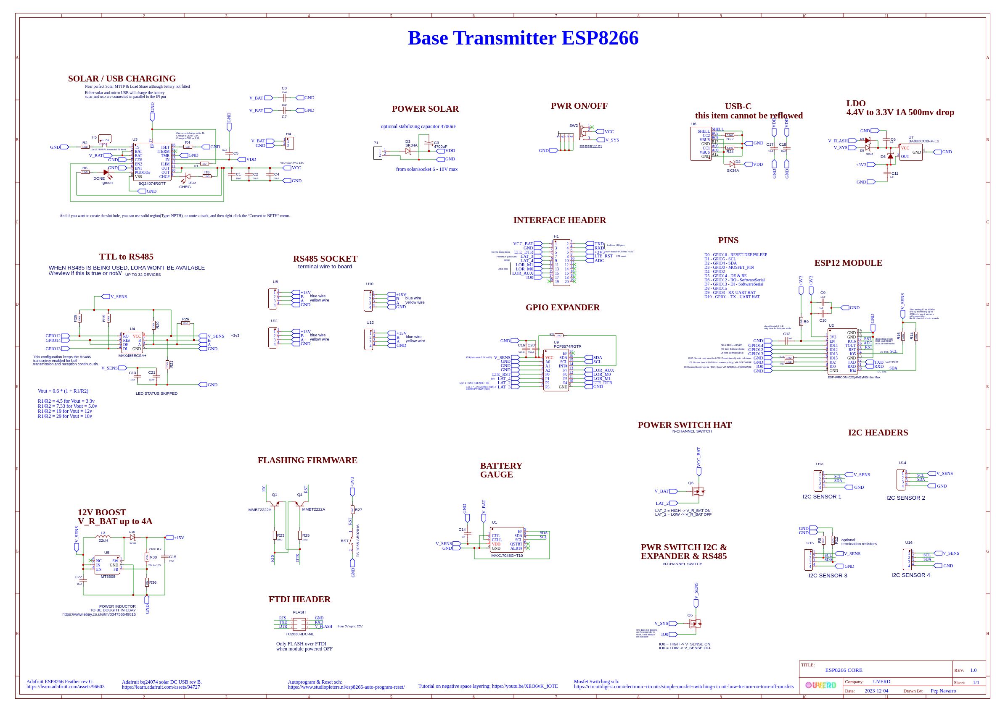
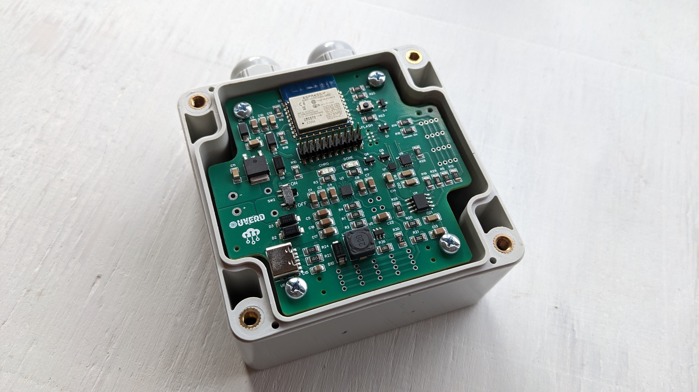

# ESP8266 based Soil Monitoring Device

---

## Overview
This is a soil monitoring device, based on the esp12e microcontroller. Using its built in WiFi functionality is able to broadcast data online. The device measures Nitrogen (N), Phosphorus (P), Potassium (K), temperature, humidity, and pH levels in the soil. It includes MPPT solar charging and supports both RS485 and I2C communication protocols. The device configuration can be modified via WiFi.

---

## Key Features
- **WiFi Functionality**: Allows the device to broadcast data online into a platform of choice via mqtt and http, by using macro flags in the ini file.
- **Smart Battery Saving**: Utilizes MOSFETs to control power to various components, ensuring efficient power usage.
- **RS485 and I2C Support**: Can communicate with various sensors and modules on the market using RS485 and I2C protocols.
- **Configurable via WiFi**: Modify device settings and configurations over a WiFi connection.
- **Multiple Sensor Support**: Measures NPK, temperature, humidity, and pH levels.
- **Expandable**: Supports additional I2C and RS485 sensors and modules.

---

## Components
- **ESP8266 Microcontroller**: Manages system operations, sensor interfacing, and data logging.
- **Adafruit BME680**: Internal sensor for measuring air quality values. Fits into the standard strain relief connector thread. 
- **RS485 Sensors**: Can connect up to 5 sensors to measure a variety of soil and water values.
- **PCF8574**: I2C GPIO expander for additional GPIO control.

---

## Hardware Design

### Schematics

*Detailed schematics of the device hardware.*

### Soil Device

*Custom PCB V2.*

*Soil-monitoring device V2.*

*Soil-monitoring device V1.*

---

## Setup and Operation

1. **Deployment**: Install the device in the soil. Ensure sensors are properly positioned for accurate measurements.
4. **Operation**: The system continuously samples sensor data and broadcasts it online. It can be configured to save power by turning off sensors when not in use.
5. **Analysis**: Use the broadcasted data to monitor soil health and make informed decisions about soil management.
6. **Maintenance**: Periodically check and maintain the system to ensure accurate monitoring and functionality.

---

## License
This project is released under the [MIT License](LICENSE.md).

---

### Author
Josep Navarro, UVERD ltd

---

### Acknowledgments
- Adafruit Industries for the MPU6050 library.
- ESP32 Arduino Core developers for the development tools and libraries.

---